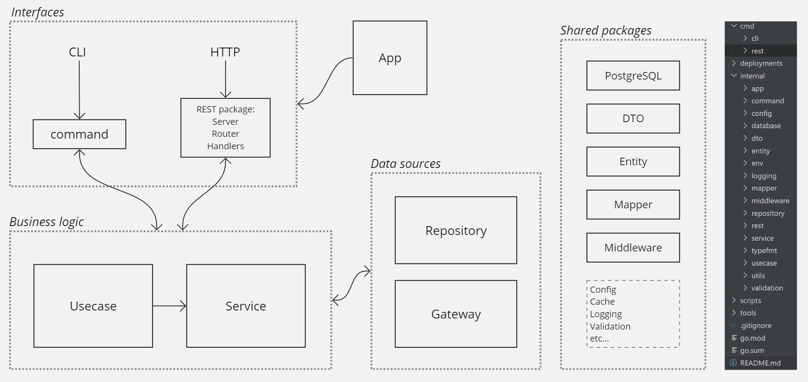
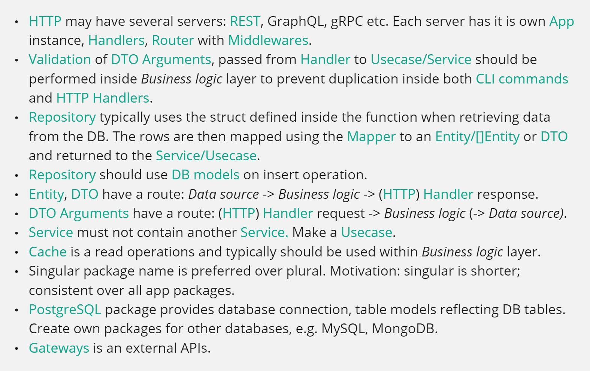

### Go app structure

This is a simple example to structure your HTTP + CLI application in Go with DDD look.

### Diagram

> DISCLAIMER: This repository is a heavily stripped down version of the real-world application. Something might not work.
