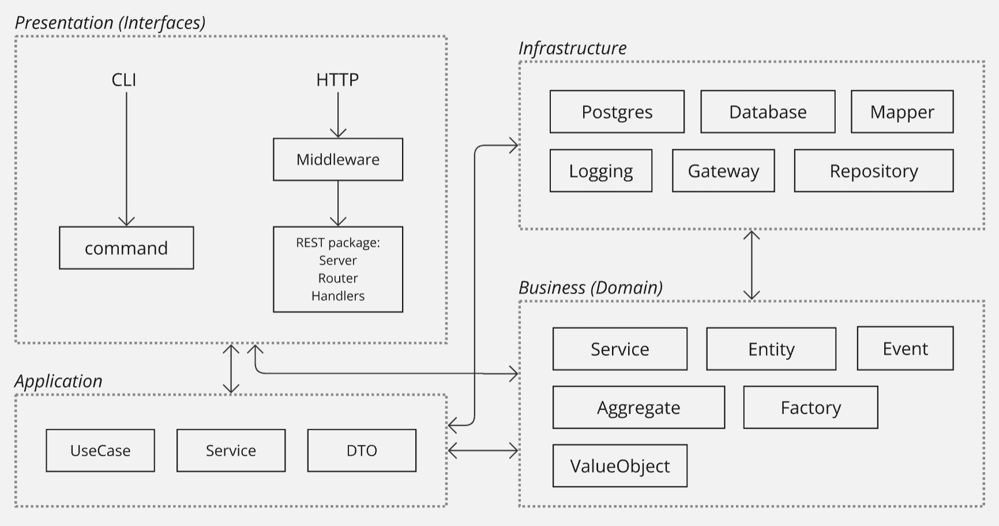

### Go app N-tier DDD

This is an example to structure your HTTP + CLI application in Go using **4-tier Architecture** with DDD. It consists of 4 layers: Presentation, Application, Business (Domain) and Infrastructure (data access). The main idea of Layered Architecture (N-tier) is to make layers independent of each other. It gives interchangeability of implementations on the each layer, so we should utilize Interfaces and not concrete implementations. Using interfaces makes it easier to test.

> DISCLAIMER: There are no ideal structure for applications which business logic is unknown yet. You can’t draw a horse if you’ve never seen one. You should create a new application based on known conditions. Layered Architecture just a good starting point.

UseCases within Application layer spans several Services from the Business layer. Because Services from Business layer should not call each other. We can jump over Application layer straight to Business if we don't need UseCases. It's a widely used practice to avoid using Layer as simple data-passing tunnel.

- HTTP may have several servers: REST, GraphQL, gRPC etc. Each server has it is own App instance, Handlers, Router with Middlewares.
- Presentation layer could bypass Application. Application layer could bypass Business. Don't use layer as dumb data passing.
- Services, UseCases, Repositories should implement interfaces to adhere to loose coupling between layers and for easier testing.
- Service must not contain another Service. Make a Usecase.
- Repository typically uses the inline struct defined inside the function when retrieving data from the DB. The rows are then mapped using the Mapper to an Entity/[]Entity or DTO and returned to the Service/Usecase.
- Repository should use DB models on insert operation.
- Singular package name is preferred over plural. Motivation: singular is shorter; consistent over all app packages.
- Postgres package provides database connection, table models reflecting DB tables. Create own packages for other databases, e.g. MySQL, MongoDB.
- Gateways are an external API services.
- Validation of DTO arguments, passed from Handler to Usecase/Service should be performed inside Business layer to prevent duplication inside both CLI commands and HTTP Handlers.

### Diagram

